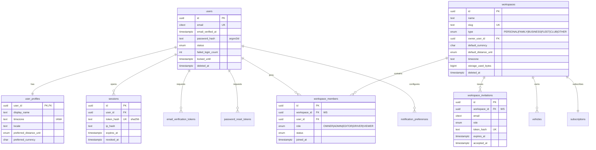
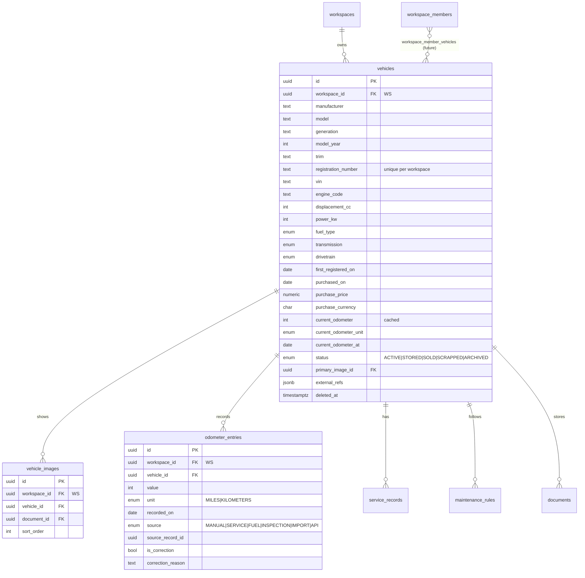
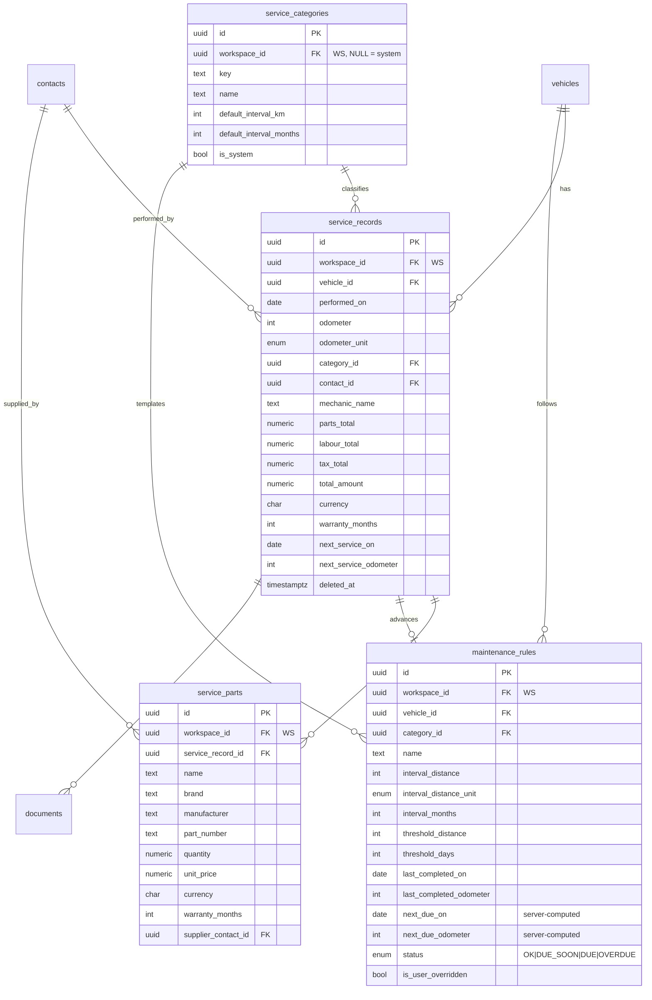
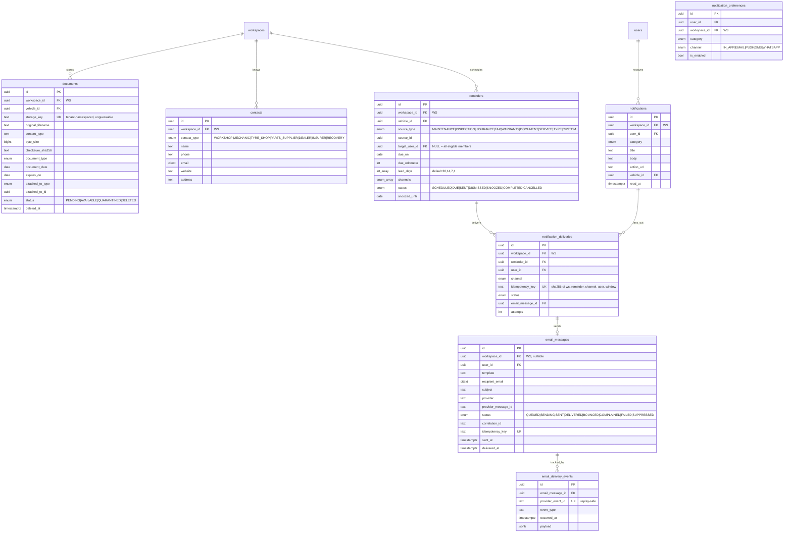

# Entity Relationship Diagram

**Version:** 1.1 · **Updated:** 2026-09-21

Split into six views for legibility. Field lists show keys and the columns that carry
meaning for relationships; see `DATABASE.md` §4 for complete definitions.

`WS` in a field list marks the `workspace_id` tenant key. Every table carrying it is
subject to the scoping rules in `ARCHITECTURE.md` §4 and the composite foreign keys in
`DATABASE.md` §3.

---

## 1. Identity and tenancy

---

## 2. Vehicle core

---

## 3. Service and maintenance

---

## 4. Ownership modules

`vehicle_inspections`, `inspection_advisories`, `insurance_policies`, `road_tax_records`,
`expense_categories` and `expenses` are built. `warranties`, `tyre_sets`,
`tyre_installations` and `fuel_entries` are not yet.

`expenses` is the single cost surface: a service, policy or tax record projects itself
into it through `source_type` / `source_record_id`, which are **unique together** so the
same record cannot be counted twice (DATABASE.md §4.8, DECISIONS.md D-058).

`road_tax_records.tax_type` is free text rather than an enum: tax regimes differ by
country (UK Vehicle Excise Duty bands have no equivalent elsewhere), and enumerating them
would make the table exactly as UK-shaped as `country_code` exists to prevent.

```mermaid
erDiagram
    vehicles ||--o{ vehicle_inspections : "passes"
    vehicle_inspections ||--o{ inspection_advisories : "notes"
    vehicles ||--o{ insurance_policies : "insured_by"
    vehicles ||--o{ road_tax_records : "taxed_by"
    vehicles ||--o{ warranties : "covered_by"
    vehicles ||--o{ tyre_sets : "fitted_with"
    tyre_sets ||--o{ tyre_installations : "mounted_as"
    vehicles ||--o{ fuel_entries : "fuelled_by"
    vehicles ||--o{ expenses : "costs"
    expense_categories ||--o{ expenses : "classifies"
    contacts ||--o{ insurance_policies : "provided_by"

    vehicle_inspections {
        uuid id PK
        uuid workspace_id FK "WS"
        uuid vehicle_id FK
        enum inspection_type "MOT|ITP|TUV|CT|..."
        date performed_on
        date expires_on
        enum result "PASS|PASS_WITH_ADVISORIES|FAIL|UNKNOWN"
        int odometer
        text certificate_number
    }
    inspection_advisories {
        uuid id PK
        uuid workspace_id FK "WS"
        uuid inspection_id FK
        enum severity
        text text
        bool is_resolved
        uuid resolved_service_record_id FK
    }
    insurance_policies {
        uuid id PK
        uuid workspace_id FK "WS"
        uuid vehicle_id FK
        text provider_name
        text policy_number
        date starts_on
        date expires_on
        numeric premium_amount
        char currency
        enum renewal_type
    }
    road_tax_records {
        uuid id PK
        uuid workspace_id FK "WS"
        uuid vehicle_id FK
        char country_code
        text tax_type
        date starts_on
        date expires_on
        numeric amount
        char currency
    }
    warranties {
        uuid id PK
        uuid workspace_id FK "WS"
        uuid vehicle_id FK
        enum warranty_type "MANUFACTURER|DEALER|THIRD_PARTY|PART|REPAIR"
        date starts_on
        date expires_on
        int distance_limit
        uuid service_record_id FK
        uuid service_part_id FK
    }
    tyre_sets {
        uuid id PK
        uuid workspace_id FK "WS"
        uuid vehicle_id FK
        text manufacturer
        text size
        enum season "SUMMER|WINTER|ALL_SEASON"
        date purchased_on
        numeric purchase_price
    }
    tyre_installations {
        uuid id PK
        uuid workspace_id FK "WS"
        uuid tyre_set_id FK
        enum position "FRONT_LEFT|FRONT_RIGHT|REAR_LEFT|REAR_RIGHT|SPARE"
        date installed_on
        int installed_odometer
        date removed_on
        numeric tread_depth_mm
    }
    fuel_entries {
        uuid id PK
        uuid workspace_id FK "WS"
        uuid vehicle_id FK
        date filled_on
        int odometer
        numeric quantity
        enum quantity_unit "LITRES|US_GALLONS|IMP_GALLONS|KWH"
        numeric total_amount
        char currency
        bool is_full_tank
    }
    expenses {
        uuid id PK
        uuid workspace_id FK "WS"
        uuid vehicle_id FK
        uuid category_id FK
        date incurred_on
        numeric amount
        char currency
        text vendor_name
        enum source_type "projection source"
        uuid source_record_id
    }
```

---

## 5. Documents, contacts, reminders, notifications

`documents` is built (DOC-101…107). `contacts` is not yet.

Files are never stored in PostgreSQL: the row holds a `storage_key` into private object
storage, and all access is a short-lived signed URL issued after a permission check
(SECURITY.md §10, DECISIONS.md D-059/D-060).

---

## 6. Commercial and platform

```mermaid
erDiagram
    plans ||--o{ plan_features : "grants"
    plans ||--o{ subscriptions : "sold_as"
    workspaces ||--|| subscriptions : "subscribes"
    workspaces ||--o{ usage_counters : "consumes"
    workspaces ||--o{ feature_overrides : "adjusted_by"
    admin_users ||--o{ support_access_grants : "requests"
    workspaces ||--o{ support_access_grants : "granted_on"
    admin_users ||--o{ audit_logs : "acts"
    users ||--o{ audit_logs : "acts"

    plans {
        uuid id PK
        text key UK "FREE|PRO|FAMILY|BUSINESS"
        text name
        bool is_public
    }
    plan_features {
        uuid id PK
        uuid plan_id FK
        text key "max_vehicles|max_members|storage_bytes|..."
        int value_int
        bool value_bool
        text value_text
    }
    subscriptions {
        uuid id PK
        uuid workspace_id FK "WS"
        uuid plan_id FK
        enum status "TRIALING|ACTIVE|PAST_DUE|CANCELLED|EXPIRED"
        text provider "nullable until billing exists"
        text provider_subscription_id
        timestamptz current_period_end
    }
    usage_counters {
        uuid id PK
        uuid workspace_id FK "WS"
        text key
        bigint value
        date period_start
        date period_end
    }
    feature_overrides {
        uuid id PK
        uuid workspace_id FK "WS"
        text key
        int value_int
        bool value_bool
        timestamptz expires_at
        text reason
    }
    admin_users {
        uuid id PK
        citext email UK
        text password_hash
        enum role "SUPER_ADMIN|OPERATIONS|SUPPORT|BILLING|READ_ONLY"
        enum status
        text mfa_secret_hash
    }
    support_access_grants {
        uuid id PK
        uuid admin_user_id FK
        uuid workspace_id FK "WS"
        text reason "required"
        text scope
        timestamptz expires_at
        timestamptz revoked_at
    }
    audit_logs {
        uuid id PK
        uuid workspace_id FK "WS, nullable"
        enum actor_type "USER|ADMIN|SYSTEM"
        uuid actor_user_id FK
        uuid actor_admin_id FK
        text action
        text resource_type
        uuid resource_id
        text ip_hash
        text correlation_id
        jsonb metadata "never secrets"
    }
    feature_flags {
        uuid id PK
        text key UK
        bool is_enabled
        int rollout_percentage
        uuid_array allowed_workspace_ids
    }
```

---

## 7. Cardinality notes

- `users ↔ workspaces` is **many-to-many** through `workspace_members`. A user can belong
  to several workspaces and switch between them; a workspace has many members.
- `workspaces → subscriptions` is one-to-one in practice (one active subscription), but is
  modelled as a table rather than columns so subscription history survives plan changes.
- `vehicles → odometer_entries` is one-to-many and **append-only**;
  `vehicles.current_odometer` is a derived cache, never authoritative.
- `service_records → maintenance_rules` is a soft, many-to-optional-one link: a service
  advances at most one rule, and a rule remembers the service that last advanced it.
- `documents.attached_to_type/attached_to_id` is a deliberate polymorphic association.
  It is not a foreign key; integrity is enforced in the application and by the shared
  `workspace_id`, because a document may attach to any of nine parent types and nine
  nullable FK columns would be worse.
