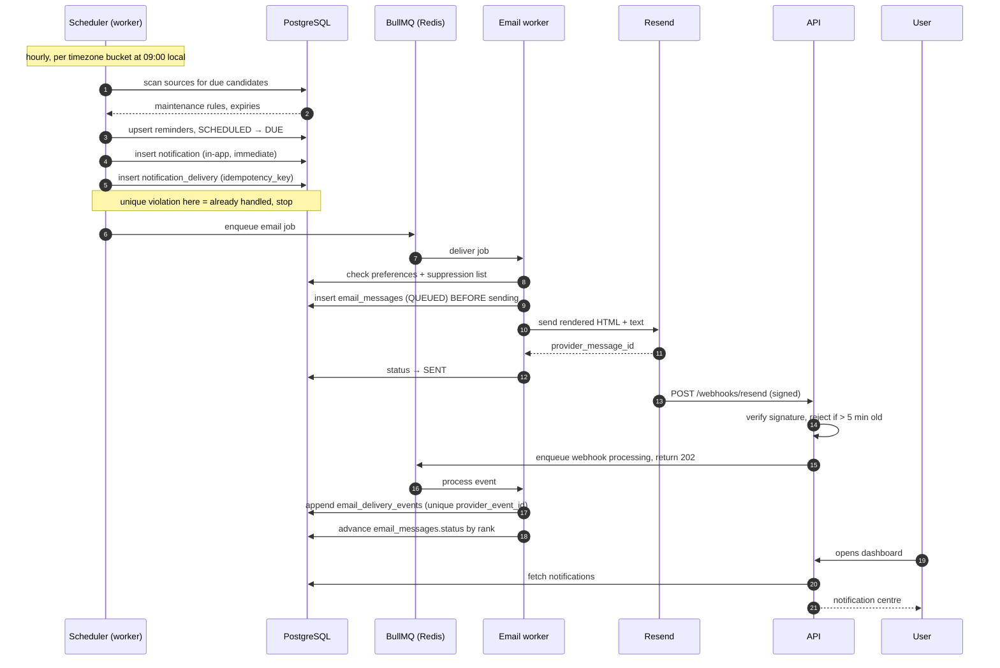
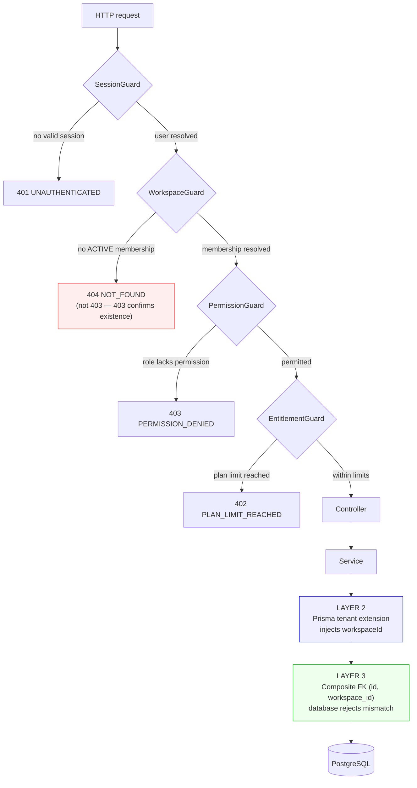
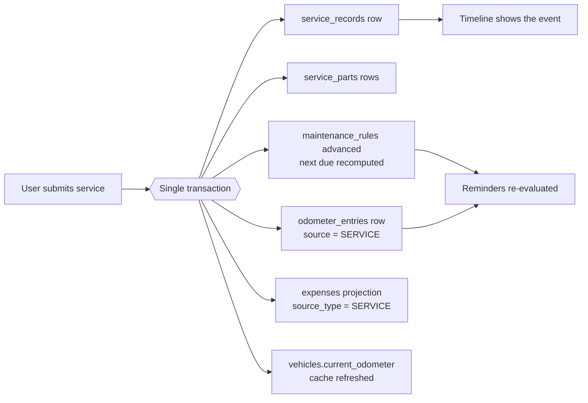
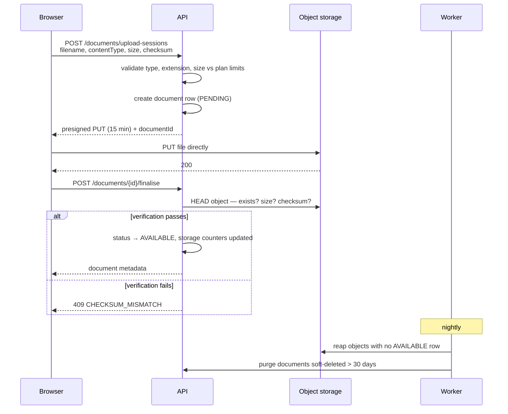

# System Flow Diagrams

Mermaid source. Rendered by GitHub and most Markdown viewers.

## 1. Reminder to email — the full trace

The path one identifier (`correlationId`) must be traceable along end to end.

## 2. Tenant isolation — three layers

## 3. Service entry — one form, five consequences

Why the user enters a service once and never maintains the rest by hand.

## 4. Document upload — the file never touches the API

